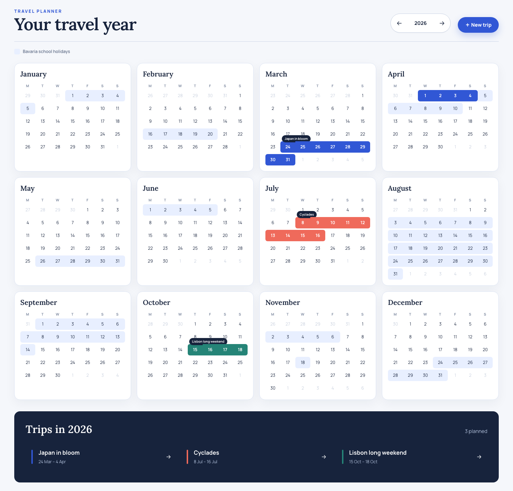
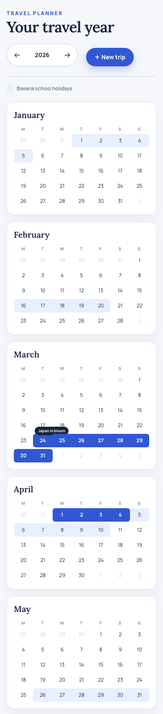

# Year calendar homepage rundown

*2026-07-12T10:40:10Z by Showboat 0.6.1*
<!-- showboat-id: 1d87adda-c629-4a67-9ab4-fc7d6631d38c -->

The root route is now a working year-at-a-glance travel dashboard.

- Twelve responsive month cards with previous and next year controls
- A primary New trip flow that creates and opens a room
- A linked trip index below the calendar
- Continuous trip ribbons with rounded caps only at visible weekly boundaries
- Light Bavaria school-holiday bands loaded for the selected year
- Trips remain the dominant layer when a trip overlaps a holiday
- Holiday API failures degrade to the normal calendar without blocking the page

Desktop layout and calendar hierarchy:

```bash {image}

```



The same UI becomes a single readable month column on mobile:

```bash {image}

```



Focused calendar, homepage, and Worker endpoint checks prove the feature behavior:

```bash
npm test -- src/features/home/yearCalendar.test.ts src/App.test.tsx worker/src/rooms.test.ts >/dev/null 2>&1 && echo '21 focused tests passed'
```

```output
21 focused tests passed
```

Static checks and the production build pass:

```bash
npm run build >/dev/null && npm run lint >/dev/null && echo 'Build and lint passed'
```

```output
Build and lint passed
```

The root-page workflow also passes in Chromium:

```bash
npx playwright test e2e/no-room.spec.ts >/dev/null 2>&1 && echo 'Homepage browser test passed'
```

```output
Homepage browser test passed
```

Implementation: branch codex/year-calendar-home in .worktrees/year-calendar-home. The school-holiday layer uses OpenHolidays subdivision DE-BY and validates external responses before rendering.
