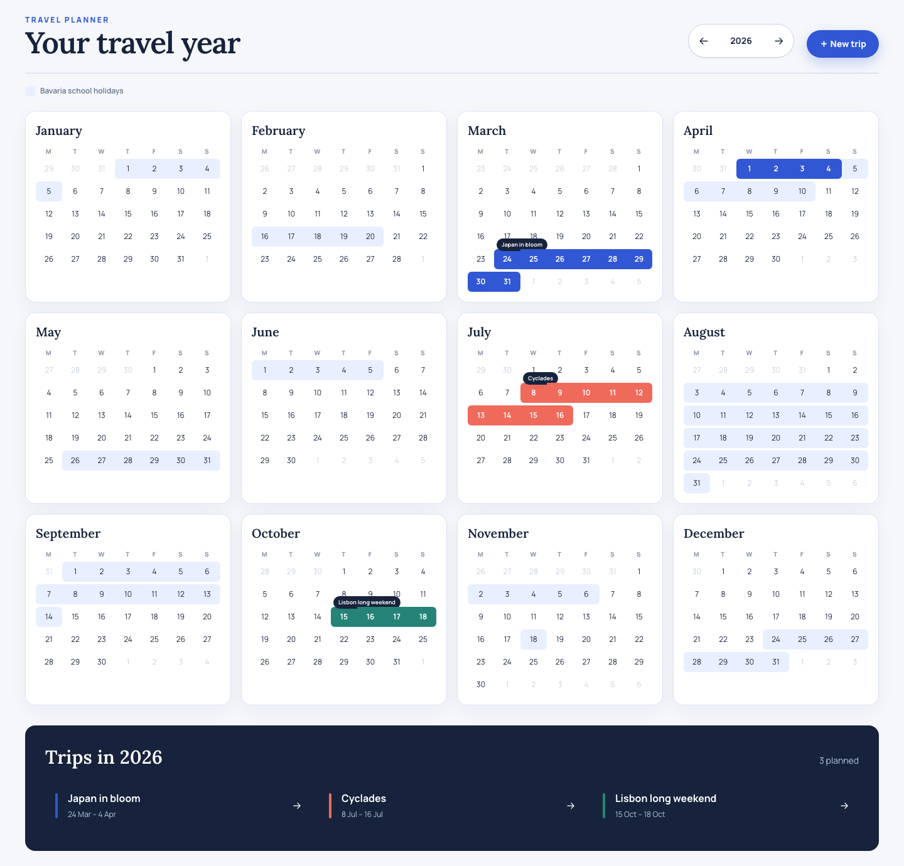
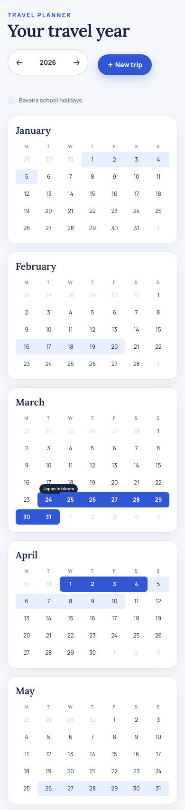

# Year calendar home

_2026-07-12T07:52:38Z by Showboat 0.6.1_

<!-- showboat-id: 1281d686-1c40-424c-882d-7162ad88c4f7 -->

A new root page turns the planner into a year-at-a-glance atlas. Trips occupy their real calendar dates as continuous weekly ribbons, continue cleanly across month and year boundaries, and remain available as direct board links in the trip index. Bavaria school holidays appear as quiet pale bands behind the calendar dates.

```bash {image}

```



The same page collapses to one readable month per row on a phone; year navigation and the New trip action remain above the fold.

```bash {image}

```



The calendar math and Worker room-summary endpoint are covered by focused tests. The complete repository suite also passes separately.

```bash
npm test -- src/features/home/yearCalendar.test.ts worker/src/rooms.test.ts >/dev/null && echo '9 focused tests passed'
```

```output
9 focused tests passed
```

```bash
npx tsc --noEmit && echo 'TypeScript check passed'
```

```output
TypeScript check passed
```

Implementation lives on branch codex/year-calendar-home in .worktrees/year-calendar-home. The production Worker paginates through 40 room documents per request, keeping every request within Cloudflare Workers Free-plan subrequest limits.
